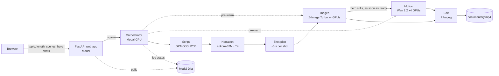

# DocuGen AI 🎬

**Type a topic, get a narrated documentary.** DocuGen AI chains open AI models on serverless GPUs. They write,
narrate, illustrate and animate a 30 second to 2 minute documentary, which FFmpeg then cuts with captions and a music score.

**Live demo:** https://nimeshgoyal02--docugen.modal.run (access code required, limited number of films per day)

| Step | Model | Runs on |
|---|---|---|
| Script (title, scenes, 4 shot ideas per scene) | GPT-OSS 120B via Groq (auto-fallback to any available model) | Groq API (free tier) |
| Narration + word timestamps | Kokoro-82M | Modal T4 GPU (~50x faster than real time) |
| Shot images | Z-Image Turbo (6B, 8 steps) | Modal L40S GPUs, up to 4 in parallel |
| Animated hero shots | Wan 2.2 I2V A14B + Lightning (4 steps) | Modal H200 GPUs, up to 4 in parallel |
| Captions | straight from the TTS word timings | Modal CPU |
| Editing | FFmpeg (eased Ken Burns, cross-dissolves, ducking, loudness) | Modal CPU |



## How it works

1. **Script.** You pick the length, the number of scenes and how many of them open with an animated shot. The LLM
   returns strict JSON: title, logline, and for every scene the narration, four shot ideas (wide, medium, close-up,
   another angle) and a motion description. Python validates and repairs it.
2. **Narration first.** Kokoro reads every scene in a few seconds on a small GPU and returns word timestamps. Knowing the
   exact length of every scene lets the editor plan the cut before any image exists.
3. **Shot plan.** Every scene is cut into ~3 second shots, so the picture keeps changing. Hero scenes open with a
   5 second video clip.
4. **Images and motion overlap.** Z-Image Turbo paints all shots on up to four GPUs, hero stills first. Each hero
   still is sent to Wan 2.2 the moment it is ready, so animation runs while the remaining stills are painted.
   The GPU containers are started while the script is being written, so model loading is hidden.
5. **Edit.** FFmpeg gives every still an eased zoom, pan or tilt, joins all shots with short cross-dissolves, adds
   title and end cards, word-timed captions and a generated music score that ducks under the voice, and normalises
   loudness to −15 LUFS, in a single final encode.

If an animation fails, that shot falls back to a Ken Burns move, and a failed image reuses the previous picture,
so a film always finishes.

**Speed:** a 1 minute film takes about 3–5 minutes once the GPUs are warm. **Cost:** roughly $0.50–1.00 per film on
Modal (mostly the H200 time for animated shots). Use fewer hero shots for cheaper, faster films.

## Deploy your own (about 5 minutes)

You need a free [Modal](https://modal.com) account and a free [Groq API key](https://console.groq.com/keys).

```bash
pip install modal
modal setup                                   # logs this terminal into your Modal account
modal secret create docugen-secrets GROQ_API_KEY=gsk_your_key ACCESS_CODE=pick-a-code DAILY_LIMIT=10
modal run docugen/modal_app.py::prefetch      # one-time: downloads the model weights into a Modal volume
modal deploy docugen/modal_app.py             # prints your public URL
```

Open the URL it prints, which looks like `https://<your-workspace>--docugen.modal.run`.

- `ACCESS_CODE` is optional. Leave it out to make the app open to anyone with the link.
- `DAILY_LIMIT` caps the films per day (UTC) to protect your credits.

**Auto-deploy from GitHub.** Fork this repo. Then add `MODAL_TOKEN_ID` and `MODAL_TOKEN_SECRET` (from Modal → Settings
→ API Tokens) under *Settings → Secrets and variables → Actions*. Every push to `main` then redeploys through
`.github/workflows/deploy.yml`. The manual **setup-and-smoke-test** workflow runs the one-time model prefetch, or
renders a short test film and prints the timing of every stage.

**From the terminal** (no browser):

```bash
modal run docugen/modal_app.py --topic "How coffee conquered the world" --seconds 60 --scenes 6 --motion 2
modal volume get docugen-jobs <job_id>/output ./my-film
```

## Local preview (no GPU, no keys)

The pipeline talks to the GPUs through a small `Backend` interface. `tests/fakes.py` provides a CPU fake, so the
whole UI and FFmpeg edit can run on a laptop:

```bash
pip install -r requirements-dev.txt          # FFmpeg must be installed
python -m docugen.dev                        # http://127.0.0.1:8000
pytest -q                                    # script validation, web API, full pipeline with the fake backend
```

## Project structure

```
docugen/
├── modal_app.py      Modal: images, volumes, GPU classes, orchestrator, web endpoint, CLI entrypoint
├── pipeline.py       stage runner, shot planner, live status (backend-agnostic)
├── script.py         LLM prompt, JSON validation & repair
├── tts.py            Kokoro narration with word timestamps
├── media.py          FFmpeg: eased Ken Burns, motion fitting, cross-dissolves, final mix
├── captions.py       caption grouping -> SRT / styled ASS
├── cards.py          title card, end card, thumbnail (Pillow)
├── music.py          procedural, royalty-free music score (numpy)
├── gpu/              Z-Image Turbo and Wan 2.2 wrappers
├── web/              FastAPI app + single-page UI (no build step)
└── dev.py            local preview with the fake backend
tests/                pytest suite (runs in GitHub Actions)
```

## Licences and responsible use

The code is under the MIT licence. Kokoro-82M, Z-Image Turbo and Wan 2.2 are released under Apache 2.0; check
each model card before commercial use.

The script prompt forbids recognisable real people, logos and on-image text. The narration can still contain factual
mistakes, so review a film before publishing it.

Built by Nimesh Goyal, with Claude as an agentic coding assistant.
