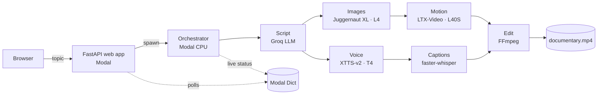

# DocuGen AI 🎬

**Type a topic, get a narrated documentary.** DocuGen AI chains five open AI models on serverless GPUs. They write,
narrate, illustrate and animate a 1–3 minute documentary, which FFmpeg then cuts with captions and a music score.

**Live demo:** https://nimeshgoyal02--docugen.modal.run (access code required, limited number of films per day)

| Step | Model | Runs on |
|---|---|---|
| Script (title, scenes, shot list) | Best available Groq LLM (Llama 3.3 70B / GPT-OSS 120B) | Groq API (free tier) |
| Narration | XTTS-v2 (Coqui) | Modal T4 GPU |
| Scene images | Juggernaut XL (SDXL) | Modal L4 GPU |
| Animated hero shots | LTX-Video (image-to-video) | Modal L40S GPU |
| Word-level captions | faster-whisper | Modal CPU |
| Editing | FFmpeg (Ken Burns, motion fitting, ducking, loudness) | Modal CPU |



## How it works

1. **Script.** The LLM returns strict JSON: a title, a logline and 5–14 scenes. Each scene has narration, a visual
   description, a camera move and a `hero` flag. Python checks the JSON and repairs what it can: it cleans the text,
   enforces the number of hero shots, and asks for a rewrite if the script is too short.
2. **Voice and images run in parallel.** XTTS-v2 narrates each scene while Juggernaut XL paints it. The images appear
   in the web UI's storyboard as soon as each one is ready.
3. **Motion.** LTX-Video turns the hero stills into ~5 second clips. If a clip fails (for example the GPU runs out of
   memory), that scene falls back to a Ken Burns move, so the film always finishes.
4. **Captions.** faster-whisper aligns every word of the narration to its timestamp. If that fails, the script timing
   is used instead.
5. **Edit.** FFmpeg animates the stills with slow zooms and pans, and fits each motion clip to its narration using a
   ping-pong loop and gentle slow-motion. It adds title and end cards, burned-in captions, and a procedurally
   generated music score that dips under the narration. The audio is normalised to −15 LUFS.

Every stage reports live progress to a `modal.Dict`, and the browser polls it. Generated files are stored on a
`modal.Volume`.

**Cost:** about **$0.20–0.40 per film** on Modal GPUs, which is covered by Modal's free monthly credits. The GPU
containers scale to zero when idle.

## Deploy your own (about 5 minutes)

You need a free [Modal](https://modal.com) account and a free [Groq API key](https://console.groq.com/keys).

```bash
pip install modal
modal setup                                   # logs this terminal into your Modal account
modal secret create docugen-secrets GROQ_API_KEY=gsk_your_key ACCESS_CODE=pick-a-code DAILY_LIMIT=10
modal deploy docugen/modal_app.py             # prints your public URL
```

Open the URL it prints, which looks like `https://<your-workspace>--docugen.modal.run`. The first film takes a few
extra minutes because the model weights are downloaded once into a cached volume.

- `ACCESS_CODE` is optional. Leave it out to make the app open to anyone with the link.
- `DAILY_LIMIT` caps the films per day (UTC) to protect your credits.

**Auto-deploy from GitHub.** Fork this repo. Then add `MODAL_TOKEN_ID` and `MODAL_TOKEN_SECRET` (from Modal → Settings
→ API Tokens) under *Settings → Secrets and variables → Actions*. Every push to `main` then redeploys through
`.github/workflows/deploy.yml`.

**From the terminal** (no browser):

```bash
modal run docugen/modal_app.py --topic "How coffee conquered the world" --seconds 120
modal volume get docugen-jobs <job_id>/output ./my-film
```

## Local preview (no GPU, no keys)

The pipeline talks to the GPUs through a small `Backend` interface. `tests/fakes.py` provides a CPU fake, so the
whole UI and FFmpeg edit can run on a laptop:

```bash
pip install -r requirements-dev.txt          # FFmpeg must be installed
python -m docugen.dev                        # http://127.0.0.1:8000
pytest -q                                    # script validation, web API, full pipeline with the fake backend
```

## Project structure

```
docugen/
├── modal_app.py      Modal: images, volumes, GPU classes, orchestrator, web endpoint, CLI entrypoint
├── pipeline.py       stage runner + live status (backend-agnostic)
├── script.py         LLM prompt, JSON validation & repair
├── media.py          FFmpeg: Ken Burns, motion fitting, narration timing, final mix
├── captions.py       faster-whisper word alignment -> SRT / styled ASS
├── cards.py          title card, end card, thumbnail (Pillow)
├── music.py          procedural, royalty-free music score (numpy)
├── gpu/              XTTS-v2, Juggernaut XL, LTX-Video wrappers
├── web/              FastAPI app + single-page UI (no build step)
└── dev.py            local preview with the fake backend
tests/                pytest suite (runs in GitHub Actions)
```

## Licences and responsible use

The code is under the MIT licence. Each model keeps its own licence: XTTS-v2 is under the Coqui Public Model Licence
(non-commercial), LTX-Video under the LTX-Video licence, and Juggernaut XL under its model card's terms. Check them
before any commercial use.

The script prompt forbids recognisable real people, logos and on-image text. The narration can still contain factual
mistakes, so review a film before publishing it.

Built by Nimesh Goyal, with Claude as an agentic coding assistant.
