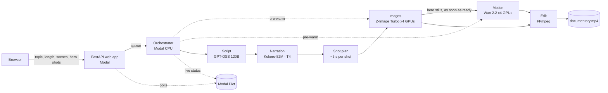

# DocuGen AI 🎬

**Type a topic, get a film.** DocuGen AI chains open AI models and two LLM agents on serverless GPUs. They write,
fact-check, narrate, design, illustrate and animate either a **9:16 reel (15–60 s)** or a **16:9 long video (1–5 min)**,
which FFmpeg then cuts with captions and a music score.

**Live demo:** https://nimeshgoyal02--docugen.modal.run (access code required, limited number of films per day)

| Step | Model | Runs on |
|---|---|---|
| Script + fact-check pass | GPT-OSS 120B via Groq (auto-fallback to any available model) | Groq API (free tier) |
| Visual Director agent (shot + motion prompts, visual bible, critic) | GPT-OSS 120B via Groq | Groq API, runs while the voice records |
| Narration + word timestamps | Kokoro-82M (8 voices) | Modal T4 GPU (~50x faster than real time) |
| Shot images | Z-Image Turbo (6B, 8 steps), 1536x864 or 864x1536 | Modal L40S GPUs, 2 (economy) or 4 (fast) in parallel |
| Animated hero shots | Wan 2.2 I2V A14B + Lightning (4 steps) | Modal H200 GPUs, 1 (economy) or up to 4 (fast) |
| Captions | straight from the TTS word timings (clean or word-by-word "pop") | Modal CPU |
| Editing | FFmpeg (eased Ken Burns, cross-dissolves, ducking, loudness) | Modal CPU |

**Customise on the web page:** format, length, scenes, animated hero shots, pacing, tone, audience, key points to
cover, 8 visual styles, 8 narrators, music mood, caption style, fact-check on/off, and economy vs fast rendering.
A live estimate shows shots, time and GPU cost before you start; the measured bill is shown after the film.



## How it works

1. **Script + fact-check.** The LLM returns strict JSON (title, logline, narration per scene, fallback shot ideas)
   shaped by the format, tone, audience and any key points; reels get a 3-second hook and punchy lines. A second
   pass checks every claim and corrects or softens anything doubtful (the corrections are listed on the job page).
2. **Narration and the Visual Director run in parallel.** Kokoro voices every scene with word timestamps. Meanwhile the
   Visual Director agent (`docugen/director.py`) reads the whole story, fixes a *visual bible* (era, places, palette,
   recurring characters with a fixed look, a motif) and writes exactly as many shot prompts per scene as the edit
   needs, following a shot grammar (wide → medium → detail → reaction, never the same framing twice) and a prompt
   recipe tuned for Z-Image Turbo and Wan 2.2. A rule-based critic flags prompts that would render garbled text,
   miss the place or era, or are too vague; only those go back to the LLM for repair.
3. **Shot plan.** Scenes are cut into short shots (about 2.4 s for reels, 4 s for long videos, adjustable pacing).
   Hero scenes open with a 5 second video clip.
4. **Images and motion overlap.** Z-Image Turbo paints all shots, hero stills first. Each hero still goes to Wan 2.2
   the moment it is ready, so animation runs while the remaining stills are painted.
5. **Edit.** FFmpeg gives every still an eased zoom, pan or tilt, joins all shots with short cross-dissolves (in
   groups for long films), adds cards (reels open with a title hook instead), captions and a generated music score
   (ambient, uplifting or tense) that ducks under the voice, and normalises loudness to −15 LUFS.

If an animation fails, that shot falls back to a Ken Burns move, and a failed image reuses the previous picture,
so a film always finishes.

**Keeping cost low.** Model loading is the biggest GPU cost, so *economy* mode caps the number of GPU containers
(each extra container loads the model again), containers scale down 40–45 s after their last call, and the GPU
classes measure their own load and busy time so every film reports its real cost (`docugen/cost.py`, Modal's
per-second prices). Animated hero shots on H200 are most of the bill; stills, voice and editing cost cents.

## Deploy your own (about 5 minutes)

You need a free [Modal](https://modal.com) account and a free [Groq API key](https://console.groq.com/keys).

```bash
pip install modal
modal setup                                   # logs this terminal into your Modal account
modal secret create docugen-secrets GROQ_API_KEY=gsk_your_key ACCESS_CODE=pick-a-code DAILY_LIMIT=10
modal run docugen/modal_app.py::prefetch      # one-time: downloads the model weights into a Modal volume
modal deploy docugen/modal_app.py             # prints your public URL
```

Open the URL it prints, which looks like `https://<your-workspace>--docugen.modal.run`.

- `ACCESS_CODE` is optional. Leave it out to make the app open to anyone with the link.
- `DAILY_LIMIT` caps the films per day (UTC) to protect your credits.

**Auto-deploy from GitHub.** Fork this repo. Then add `MODAL_TOKEN_ID` and `MODAL_TOKEN_SECRET` (from Modal → Settings
→ API Tokens) under *Settings → Secrets and variables → Actions*. Every push to `main` then redeploys through
`.github/workflows/deploy.yml`. The manual **setup-and-smoke-test** workflow runs the one-time model prefetch, or
renders a short test film and prints the timing of every stage.

**From the terminal** (no browser):

```bash
modal run docugen/modal_app.py --topic "How coffee conquered the world" --seconds 60 --scenes 6 --motion 2
modal run docugen/modal_app.py --topic "Why octopuses are so smart" --format reel --seconds 30 --motion 1
modal volume get docugen-jobs <job_id>/output ./my-film
```

## Local preview (no GPU, no keys)

The pipeline talks to the GPUs through a small `Backend` interface. `tests/fakes.py` provides a CPU fake, so the
whole UI and FFmpeg edit can run on a laptop:

```bash
pip install -r requirements-dev.txt          # FFmpeg must be installed
python -m docugen.dev                        # http://127.0.0.1:8000
pytest -q                                    # script validation, web API, full pipeline with the fake backend
```

## Project structure

```
docugen/
├── modal_app.py      Modal: images, volumes, GPU classes, orchestrator, web endpoint, CLI entrypoint
├── pipeline.py       stage runner, shot planner, live status (backend-agnostic)
├── script.py         writer + fact-checker prompts, JSON validation & repair
├── director.py       Visual Director agent: visual bible, shot prompts, motion prompts, critic + repair
├── cost.py           cost estimate before a run and measured bill after it
├── tts.py            Kokoro narration with word timestamps
├── media.py          FFmpeg: eased Ken Burns, motion fitting, cross-dissolves, final mix
├── captions.py       caption grouping -> SRT / styled ASS
├── cards.py          title card, end card, thumbnail (Pillow)
├── music.py          procedural, royalty-free music score (numpy)
├── gpu/              Z-Image Turbo and Wan 2.2 wrappers
├── web/              FastAPI app + single-page UI (no build step)
└── dev.py            local preview with the fake backend
tests/                pytest suite (runs in GitHub Actions)
```

## Licences and responsible use

The code is under the MIT licence. Kokoro-82M, Z-Image Turbo and Wan 2.2 are released under Apache 2.0; check
each model card before commercial use.

The script prompt forbids recognisable real people, logos and on-image text. The narration can still contain factual
mistakes, so review a film before publishing it.

Built by Nimesh Goyal, with Claude as an agentic coding assistant.
